# ArcticOps — System Architecture & Folder Structure

> **Purpose**: Define exactly how the codebase is organized so that every file has a clear home and no code lands in random places.

---

## 1. Tech Stack

| Layer | Technology | Version | Rationale |
|---|---|---|---|
| **Framework** | Next.js (App Router) | 15 | SSR/SSG, file-based routing, route groups for multi-dashboard layout, image optimization |
| **Language** | TypeScript | 5.x | Type safety across the entire codebase — critical for a complex multi-role, multi-tenant system |
| **Styling** | Tailwind CSS | v4 | Utility-first, dark mode built-in, design token support via CSS variables, fast iteration |
| **UI Components** | shadcn/ui + Radix Primitives | Latest | Accessible, composable, fully customizable — no black-box component library |
| **Maps** | Mapbox GL JS via react-map-gl | Latest | Premium dark map styles, custom markers, route animation, weather overlays |
| **Charts** | Recharts | Latest | React-native charting, composable, supports sparklines, area charts, radial gauges |
| **State Management** | Zustand | Latest | Lightweight, no boilerplate, supports middleware (persistence, devtools), perfect for mock data stores |
| **Animations** | Framer Motion | Latest | Production-grade React animations — layout animations, shared layout, gesture support, exit animations |
| **Icons** | Lucide React | Latest | Consistent, tree-shakeable icon set. No emojis in the UI |
| **Date/Time** | date-fns | Latest | Lightweight date manipulation for ETAs, timestamps, countdowns |
| **Forms** | React Hook Form + Zod | Latest | Performant form handling with schema validation — needed for order builder wizard, signup, document forms |
| **Command Palette** | cmdk | Latest | Cmd+K search interface (by pacocoursey — same author as shadcn/ui patterns) |

---

## 2. Project Folder Structure

```
arcticops/
├── public/
│   ├── fonts/                          # Self-hosted fonts (Space Grotesk, IBM Plex Sans, JetBrains Mono)
│   ├── images/
│   │   ├── logo/                       # ArcticOps logo variants (light, dark, icon)
│   │   ├── empty-states/              # Illustrated empty state SVGs
│   │   └── onboarding/               # Onboarding wizard illustrations
│   └── favicon.ico
│
├── src/
│   ├── env.d.ts                        # TypeScript declarations for environment variables
│   ├── app/
│   │   ├── layout.tsx                  # Root layout — providers, fonts, global meta
│   │   ├── providers.tsx               # Client component wrapping children with AnimatePresence, Zustand hydration, context providers
│   │   ├── page.tsx                    # Landing / redirect based on auth state
│   │   ├── not-found.tsx              # Custom 404 page (ArcticOps themed)
│   │   ├── error.tsx                  # Custom error boundary page (ArcticOps themed)
│   │   ├── globals.css                 # Tailwind directives, CSS variables, global animation keyframes
│   │   │
│   │   ├── (auth)/                     # Auth route group — no sidebar, centered layout
│   │   │   ├── layout.tsx             # Auth layout — frosted glass background, cold-to-warm theme
│   │   │   ├── login/
│   │   │   │   └── page.tsx
│   │   │   ├── signup/
│   │   │   │   └── page.tsx           # Signup with activation code entry
│   │   │   └── setup/
│   │   │       └── page.tsx           # Organization setup wizard (3 steps)
│   │   │
│   │   ├── (ops)/                      # Operations route group — sidebar layout, dark control room
│   │   │   ├── layout.tsx             # Ops layout — sidebar nav, header, notification tray, ambient bg
│   │   │   ├── dashboard/
│   │   │   │   └── page.tsx           # Command Center — globe map, KPIs, activity feed
│   │   │   ├── shipments/
│   │   │   │   ├── page.tsx           # Shipment list — table + kanban toggle
│   │   │   │   └── [id]/
│   │   │   │       └── page.tsx       # Shipment detail — temp chart, route map, docs, comms
│   │   │   ├── inventory/
│   │   │   │   └── page.tsx           # Procurement & inventory — catalog, stock levels, requests queue
│   │   │   ├── route-planner/
│   │   │   │   └── page.tsx           # Route comparison panel + scenario simulator
│   │   │   ├── carriers/
│   │   │   │   └── page.tsx           # Carrier directory, capacity calendar, performance
│   │   │   ├── transport/
│   │   │   │   ├── page.tsx           # Crew operations overview
│   │   │   │   ├── crew/
│   │   │   │   │   └── [id]/
│   │   │   │   │       └── page.tsx   # Individual crew profile (mode-adaptive)
│   │   │   │   └── system-health/
│   │   │   │       └── page.tsx       # Live cold-chain monitoring dashboard
│   │   │   ├── compliance/
│   │   │   │   └── page.tsx           # Document repository, audit trail, regulatory calendar
│   │   │   ├── analytics/
│   │   │   │   └── page.tsx           # Predictive delays, excursion heatmap, cost optimization
│   │   │   ├── notifications/
│   │   │   │   └── page.tsx           # Full notification list with filters
│   │   │   ├── profile/
│   │   │   │   └── page.tsx           # User profile, password change, preferences
│   │   │   └── settings/
│   │   │       └── page.tsx           # Users, roles, tenant management, system config
│   │   │
│   │   ├── (client)/                   # Client route group — cleaner sidebar, tenant-scoped
│   │   │   ├── layout.tsx             # Client layout — sidebar nav, header, tenant context
│   │   │   ├── home/
│   │   │   │   └── page.tsx           # Active orders overview, quick stats
│   │   │   ├── tracker/
│   │   │   │   └── [id]/
│   │   │   │       └── page.tsx       # Live shipment tracker — map + checkpoints + temp strip
│   │   │   ├── procurement/
│   │   │   │   ├── page.tsx           # Material catalog
│   │   │   │   ├── order/
│   │   │   │   │   └── page.tsx       # 5-step order builder wizard
│   │   │   │   └── history/
│   │   │   │       └── page.tsx       # Order history with status and downloads
│   │   │   ├── documents/
│   │   │   │   └── page.tsx           # Document center + compliance dashboard
│   │   │   ├── communications/
│   │   │   │   └── page.tsx           # Threaded messaging + announcements
│   │   │   ├── notifications/
│   │   │   │   └── page.tsx           # Full notification list with filters (tenant-scoped)
│   │   │   ├── profile/
│   │   │   │   └── page.tsx           # User profile, preferences
│   │   │   └── settings/
│   │   │       └── page.tsx           # Team members, notification prefs, org profile
│   │   │
│   │   └── (driver)/                   # Driver route group — mobile-first, bottom nav
│   │       ├── layout.tsx             # Driver layout — bottom tab nav, minimal header
│   │       ├── assignment/
│   │       │   └── page.tsx           # Current assignment + history
│   │       ├── navigate/
│   │       │   └── page.tsx           # Route map + checkpoints + alternate routes
│   │       ├── monitor/
│   │       │   └── page.tsx           # Temperature monitoring + refrigeration status
│   │       ├── documents/
│   │       │   └── page.tsx           # Document checklist + upload
│   │       ├── deliver/
│   │       │   └── page.tsx           # Delivery confirmation + proof capture
│   │       └── notifications/
│   │           └── page.tsx           # Notification list (assignment-scoped)
│   │
│   ├── components/
│   │   ├── ui/                         # shadcn/ui components (auto-generated by CLI)
│   │   │   ├── button.tsx
│   │   │   ├── card.tsx
│   │   │   ├── badge.tsx
│   │   │   ├── input.tsx
│   │   │   ├── select.tsx
│   │   │   ├── dialog.tsx
│   │   │   ├── dropdown-menu.tsx
│   │   │   ├── table.tsx
│   │   │   ├── tabs.tsx
│   │   │   ├── toast.tsx
│   │   │   ├── tooltip.tsx
│   │   │   ├── command.tsx             # cmdk integration for global search
│   │   │   ├── separator.tsx
│   │   │   ├── skeleton.tsx
│   │   │   ├── progress.tsx
│   │   │   ├── avatar.tsx
│   │   │   └── ... (other shadcn components as needed)
│   │   │
│   │   ├── shared/                     # Cross-dashboard shared components
│   │   │   ├── app-sidebar.tsx        # Configurable sidebar (different items per dashboard)
│   │   │   ├── header.tsx             # Top header bar with search trigger, notifications, profile
│   │   │   ├── notification-center.tsx # Bell icon dropdown with notification list
│   │   │   ├── command-palette.tsx    # Cmd+K global search overlay
│   │   │   ├── kpi-card.tsx           # Stat card with label, value, trend, icon
│   │   │   ├── status-badge.tsx       # Color-coded status indicator with icon redundancy
│   │   │   ├── temperature-badge.tsx  # Temp display with zone coloring + icon
│   │   │   ├── risk-score.tsx         # Radial gauge for risk/confidence scores
│   │   │   ├── sparkline.tsx          # Inline mini chart for tables and cards
│   │   │   ├── empty-state.tsx        # Illustrated empty state with arctic landscape
│   │   │   ├── loading-crystallize.tsx # Crystallization animation loader
│   │   │   ├── frost-transition.tsx   # Page transition wrapper (frost dissolve)
│   │   │   ├── ambient-background.tsx # Stress-aware animated background
│   │   │   ├── activity-feed.tsx      # Real-time event log component
│   │   │   ├── document-checklist.tsx # Document validation status list
│   │   │   ├── stepper.tsx            # Multi-step wizard stepper
│   │   │   └── data-table.tsx         # Enhanced table with sorting, filtering, sparklines
│   │   │
│   │   ├── ops/                        # Operations-specific components
│   │   │   ├── globe-map.tsx          # World map for command center
│   │   │   ├── shipment-kanban.tsx    # Kanban board for shipment statuses
│   │   │   ├── shipment-table.tsx     # Shipment list table with filters
│   │   │   ├── temp-timeline.tsx      # Temperature timeline chart with safe bands
│   │   │   ├── route-comparison.tsx   # Side-by-side route option cards
│   │   │   ├── route-map.tsx          # Route visualization on map
│   │   │   ├── scenario-panel.tsx     # What-if scenario simulator controls
│   │   │   ├── stock-level-bar.tsx    # Battery-style inventory indicator
│   │   │   ├── procurement-queue.tsx  # Procurement request list with actions
│   │   │   ├── carrier-card.tsx       # Carrier profile card
│   │   │   ├── capacity-calendar.tsx  # Gantt-like carrier availability
│   │   │   ├── crew-profile.tsx       # Mode-adaptive crew profile
│   │   │   ├── cold-chain-health.tsx  # Live monitoring per-shipment cards
│   │   │   ├── audit-log.tsx          # Filterable audit trail table
│   │   │   ├── compliance-checklist.tsx # Auto-validation document status
│   │   │   ├── delay-forecast.tsx     # Predictive delay visualization
│   │   │   └── excursion-heatmap.tsx  # Temperature excursion heatmap
│   │   │
│   │   ├── client/                     # Client-specific components
│   │   │   ├── order-card.tsx         # Active order summary card with ETA countdown
│   │   │   ├── shipment-map.tsx       # Full-width live tracking map
│   │   │   ├── checkpoint-flow.tsx    # Horizontal checkpoint stepper
│   │   │   ├── temp-strip.tsx         # Temperature strip chart below checkpoints
│   │   │   ├── material-card.tsx      # Material catalog item card
│   │   │   ├── order-wizard.tsx       # 5-step order builder wizard container
│   │   │   ├── order-step-materials.tsx
│   │   │   ├── order-step-coldchain.tsx
│   │   │   ├── order-step-delivery.tsx
│   │   │   ├── order-step-routes.tsx
│   │   │   ├── order-step-review.tsx
│   │   │   ├── document-download.tsx  # Document card with download action
│   │   │   ├── message-thread.tsx     # Threaded message component
│   │   │   └── compliance-overview.tsx # Client compliance status grid
│   │   │
│   │   ├── driver/                     # Driver-specific components
│   │   │   ├── assignment-card.tsx    # Current assignment summary
│   │   │   ├── bottom-nav.tsx         # Mobile bottom tab navigation
│   │   │   ├── route-view.tsx         # Simplified route map for driver
│   │   │   ├── temp-monitor.tsx       # Real-time temperature display
│   │   │   ├── compartment-card.tsx   # Per-compartment temp status
│   │   │   ├── doc-upload.tsx         # Camera/file upload for documents
│   │   │   ├── doc-checklist.tsx      # Document checklist with status
│   │   │   ├── delivery-form.tsx      # Delivery confirmation form
│   │   │   ├── signature-pad.tsx      # Canvas signature capture
│   │   │   └── emergency-panel.tsx    # Emergency actions panel
│   │   │
│   │   ├── maps/                       # Shared map components
│   │   │   ├── base-map.tsx           # Mapbox wrapper with dark theme, controls — checks for token and renders fallback if missing
│   │   │   ├── map-fallback.tsx       # Static SVG world map fallback when Mapbox token unavailable
│   │   │   ├── shipment-marker.tsx    # Animated shipment dot on map
│   │   │   ├── route-layer.tsx        # Animated route line layer
│   │   │   ├── weather-layer.tsx      # Weather overlay toggle
│   │   │   ├── cold-storage-markers.tsx # Nearby cold storage facility markers
│   │   │   └── geofence-layer.tsx     # Geofence zone visualization
│   │   │
│   │   └── charts/                     # Shared chart components
│   │       ├── area-chart.tsx         # Reusable area chart (temp timelines)
│   │       ├── radial-gauge.tsx       # Circular gauge (risk score, confidence)
│   │       ├── bar-chart.tsx          # Bar chart (analytics, comparisons)
│   │       ├── heatmap-chart.tsx      # Heatmap (excursion analytics)
│   │       └── sparkline-chart.tsx    # Inline sparkline for tables
│   │
│   ├── lib/
│   │   ├── mock-data/                  # Mock data generators and static fixtures
│   │   │   ├── shipments.ts           # Mock shipment data + generator
│   │   │   ├── materials.ts           # Raw material catalog data
│   │   │   ├── carriers.ts            # Carrier directory data
│   │   │   ├── crews.ts              # Crew/driver profiles
│   │   │   ├── clients.ts            # Client tenant data
│   │   │   ├── routes.ts             # Pre-computed route options
│   │   │   ├── documents.ts          # Mock compliance documents
│   │   │   ├── notifications.ts      # Mock alert/notification data
│   │   │   ├── temperature.ts        # Temperature stream simulator
│   │   │   ├── gps.ts                # GPS coordinate simulator (route animation)
│   │   │   └── analytics.ts          # Mock analytics/prediction data
│   │   │
│   │   ├── store/                      # Zustand state stores
│   │   │   ├── auth-store.ts          # Auth state — user, role, tenant, token
│   │   │   ├── shipment-store.ts      # Shipment list, selected shipment, filters
│   │   │   ├── inventory-store.ts     # Material stock levels, procurement requests
│   │   │   ├── carrier-store.ts       # Carrier data, capacity
│   │   │   ├── notification-store.ts  # Notifications, alert queue, severity levels
│   │   │   ├── temperature-store.ts   # Live temperature data per shipment
│   │   │   ├── route-store.ts         # Route comparison data, scenario state
│   │   │   ├── ui-store.ts            # UI state — sidebar open, command palette, stress level
│   │   │   └── driver-store.ts        # Driver-specific state — assignment, delivery progress
│   │   │
│   │   ├── hooks/                      # Custom React hooks
│   │   │   ├── use-auth.ts            # Auth context hook (role, tenant, permissions)
│   │   │   ├── use-temperature-stream.ts # Simulated real-time temp data hook
│   │   │   ├── use-gps-stream.ts      # Simulated GPS position updates
│   │   │   ├── use-notifications.ts   # Notification subscription hook
│   │   │   ├── use-stress-level.ts    # Calculates UI stress level from system state
│   │   │   ├── use-countdown.ts       # ETA countdown timer
│   │   │   ├── use-media-query.ts     # Responsive breakpoint detection
│   │   │   └── use-command-palette.ts # Cmd+K keyboard shortcut handler
│   │   │
│   │   ├── utils/                      # Pure utility functions
│   │   │   ├── cn.ts                  # Tailwind class merge utility (clsx + twMerge)
│   │   │   ├── format.ts             # Date, number, currency, temperature formatting
│   │   │   ├── temperature.ts        # Temp zone classification, safe range checks, color mapping
│   │   │   ├── risk.ts               # Risk score calculation utilities
│   │   │   ├── permissions.ts        # Role-based permission checks
│   │   │   ├── routes.ts             # Route path constants and navigation helpers
│   │   │   ├── motion.ts             # Shared Framer Motion variants (pageVariants, cardVariants, toastVariants)
│   │   │   └── validation.ts         # Zod schemas for forms (order, signup, etc.)
│   │   │
│   │   ├── types/                      # TypeScript type definitions
│   │   │   ├── auth.ts               # User, Role, Tenant, Session types
│   │   │   ├── shipment.ts           # Shipment, Checkpoint, ShipmentStatus types
│   │   │   ├── inventory.ts          # Material, StockLevel, ProcurementRequest types
│   │   │   ├── carrier.ts            # Carrier, Capacity, PerformanceMetrics types
│   │   │   ├── crew.ts               # CrewMember, TransportMode, Document types
│   │   │   ├── route.ts              # Route, RouteLeg, RouteOption, Scenario types
│   │   │   ├── temperature.ts        # TempReading, TempZone, Excursion types
│   │   │   ├── notification.ts       # Notification, AlertSeverity, AlertEscalation types
│   │   │   ├── compliance.ts         # ComplianceDoc, AuditEntry, ValidationStatus types
│   │   │   └── analytics.ts          # Prediction, HeatmapData, CostReport types
│   │   │
│   │   └── constants/                  # Application constants
│   │       ├── roles.ts               # Role definitions and permission maps
│   │       ├── temperature-zones.ts   # Temp ranges (2–8°C, -20°C, -70°C) with labels and colors
│   │       ├── shipment-statuses.ts   # Status definitions with labels, colors, icons
│   │       ├── transport-modes.ts     # Air, sea, rail, road — icons, labels, document requirements
│   │       ├── nav-items.ts           # Navigation items per dashboard role
│   │       └── map-config.ts          # Mapbox style URLs, default viewport, marker configs, MAPBOX_FALLBACK_ENABLED flag
│   │
│   └── styles/                         # Global styles beyond Tailwind
│       └── animations.css             # Custom CSS keyframes (crystallization, frost, aurora, pulse)
│
├── .env.local                          # Environment variables (Mapbox token, etc.)
├── next.config.ts                      # Next.js configuration
├── tailwind.config.ts                  # Tailwind CSS v4 configuration with ArcticOps theme
├── tsconfig.json                       # TypeScript configuration
├── package.json                        # Dependencies and scripts
├── postcss.config.js                   # PostCSS configuration
├── components.json                     # shadcn/ui configuration
└── README.md                           # Project README
```

---

## 3. Route Group Architecture

Next.js 15 App Router route groups (parenthesized folders) allow separate layouts without affecting URL paths.

```
URL Path                    Route Group     Layout
─────────────────────────   ────────────    ──────────────────────────
/login                      (auth)          Centered, no sidebar, frost bg
/signup                     (auth)          ↑
/setup                      (auth)          ↑
/dashboard                  (ops)           Sidebar, dark control room, ambient bg
/shipments                  (ops)           ↑
/shipments/[id]             (ops)           ↑
/inventory                  (ops)           ↑
/route-planner              (ops)           ↑
/carriers                   (ops)           ↑
/transport                  (ops)           ↑
/compliance                 (ops)           ↑
/analytics                  (ops)           ↑
/notifications (ops)        (ops)           ↑
/profile (ops)              (ops)           ↑
/settings (ops)             (ops)           ↑
/home                       (client)        Sidebar (lighter), tenant-scoped header
/tracker/[id]               (client)        ↑
/procurement                (client)        ↑
/procurement/order          (client)        ↑
/procurement/history        (client)        ↑
/documents                  (client)        ↑
/communications             (client)        ↑
/notifications (client)     (client)        ↑
/profile (client)           (client)        ↑
/settings (client)          (client)        ↑
/assignment                 (driver)        Bottom tab nav, mobile-first, minimal header
/navigate                   (driver)        ↑
/monitor                    (driver)        ↑
/documents (driver)         (driver)        ↑
/deliver                    (driver)        ↑
/notifications (driver)     (driver)        ↑
```

### Layout Hierarchy

```
Root Layout (layout.tsx)
├── Providers (providers.tsx — AnimatePresence, Zustand, context providers)
├── Font loading (Space Grotesk, IBM Plex Sans, JetBrains Mono)
├── Global CSS
│
├── (auth)/layout.tsx
│   └── Centered card layout, frosted glass bg, no nav
│
├── (ops)/layout.tsx
│   ├── Sidebar (collapsible, dark, with nav items for ops)
│   ├── Header (search trigger, notifications, profile, tenant selector)
│   ├── Ambient Background (stress-aware)
│   └── Main content area
│
├── (client)/layout.tsx
│   ├── Sidebar (cleaner, lighter version, client nav items)
│   ├── Header (search trigger, notifications, profile, tenant name)
│   └── Main content area
│
└── (driver)/layout.tsx
    ├── Minimal Header (assignment name, status indicator)
    ├── Main content area (full height)
    └── Bottom Tab Navigation (5 tabs: Assignment, Navigate, Monitor, Docs, Deliver)
```

### Role-Based Middleware

A Next.js middleware at `src/middleware.ts` intercepts all requests and:

1. Checks for valid auth token (mock JWT from cookie/header)
2. Extracts role and tenant from token claims
3. Redirects unauthorized users to `/login`
4. Prevents role-inappropriate access:
   - Ops roles → can only access `(ops)` routes
   - Client roles → can only access `(client)` routes
   - Driver role → can only access `(driver)` routes
5. Injects tenant context into request headers for data scoping

---

## 4. Component Architecture

### Design Principles

1. **Composition over inheritance** — components are built by composing smaller primitives
2. **Shared components** handle cross-cutting concerns (maps, charts, status badges, temp displays)
3. **Dashboard-specific components** combine shared primitives into contextual UI
4. **Page components** orchestrate layout, data fetching, and component composition
5. **All components are client components** by default (rich interactivity), with `"use client"` directive. Server components used only for static layout shells

### Component Naming Convention

```
Pattern: [context]-[element].tsx
Examples:
  shipment-table.tsx      (ops context, table element)
  order-card.tsx           (client context, card element)
  temp-monitor.tsx         (driver context, monitoring display)
  base-map.tsx             (shared context, map wrapper)
  radial-gauge.tsx         (shared context, chart type)
```

### Props Pattern

Every component follows a consistent props pattern:

```typescript
interface ShipmentTableProps {
  shipments: Shipment[]
  onSelect: (id: string) => void
  filters?: ShipmentFilters
  className?: string
}
```

- Data passed as props (not fetched internally)
- Callbacks for interactions
- Optional configuration
- Always accept `className` for Tailwind composition

---

## 5. State Management Strategy

### Zustand Store Architecture

```
┌──────────────────────────────────────────────────────────┐
│                     Zustand Stores                        │
├──────────────┬──────────────┬──────────────┬─────────────┤
│  auth-store  │ shipment-    │ temperature- │ notification│
│              │ store        │ store        │ -store      │
│ • user       │ • shipments  │ • readings   │ • alerts    │
│ • role       │ • selected   │ • excursions │ • queue     │
│ • tenant     │ • filters    │ • streams    │ • severity  │
│ • token      │ • view mode  │ • history    │ • escalation│
├──────────────┼──────────────┼──────────────┼─────────────┤
│ inventory-   │ carrier-     │ route-store  │ ui-store    │
│ store        │ store        │              │             │
│ • materials  │ • carriers   │ • options    │ • sidebar   │
│ • stock      │ • capacity   │ • selected   │ • cmdPalette│
│ • requests   │ • performance│ • scenario   │ • stressLvl │
│ • restockETA │ • schedule   │ • comparison │ • theme     │
├──────────────┴──────────────┴──────────────┼─────────────┤
│                driver-store                 │             │
│ • assignment • delivery • docs • emergency │             │
└────────────────────────────────────────────┴─────────────┘
```

### When to Use What

| Mechanism | Use Case |
|---|---|
| **Zustand store** | Global state shared across multiple components or pages: auth, shipments, temperature data, notifications, UI state |
| **React Context** | Layout-scoped state — tenant context in client layout, transport mode in driver layout |
| **Component state (useState)** | Local UI state — form inputs, dropdown open/close, tooltip visibility |
| **URL state (searchParams)** | Filters, pagination, view mode toggles — anything that should be shareable via URL |

### Store Initialization Flow

```
App Loads
    ↓
Root Layout mounts
    ↓
Providers component wraps children (AnimatePresence, context)
    ↓
Auth Store hydrates from mock token (cookie/localStorage)
    ↓
Role + Tenant determined
    ↓
Middleware redirects to correct dashboard
    ↓
Dashboard Layout mounts
    ↓
Layout initializes relevant stores with mock data:
  - (ops): all stores load full mock data
  - (client): stores load tenant-scoped mock data only
  - (driver): driver-store loads assigned shipment data only
    ↓
Temperature + GPS streams start (setInterval simulations)
    ↓
Notification store begins generating mock alerts
```

---

## 6. Mock Data Layer

Since ArcticOps is frontend-only, all data is mocked. The mock layer must feel realistic for hackathon judges.

### Architecture

```
┌─────────────────────────────────┐
│         UI Components            │
│  (read from Zustand stores)      │
└──────────┬──────────────────────┘
           │ subscribe
┌──────────▼──────────────────────┐
│         Zustand Stores           │
│  (single source of truth)        │
└──────────┬──────────────────────┘
           │ hydrate from
┌──────────▼──────────────────────┐
│      Mock Data Generators        │
│  (lib/mock-data/*.ts)            │
│                                  │
│  Static fixtures:                │
│  • 12 shipments across statuses  │
│  • 25 raw materials in catalog   │
│  • 8 carrier companies           │
│  • 15 crew members (multi-mode)  │
│  • 3 client tenants              │
│  • 40+ compliance documents      │
│                                  │
│  Dynamic generators:             │
│  • Temperature stream simulator  │
│  • GPS coordinate animator       │
│  • Notification event generator  │
│  • Stock level fluctuation       │
└─────────────────────────────────┘
```

All data flows through Zustand stores directly — no API routes needed for a frontend-only mock-data application.

### Real-Time Simulation

Temperature and GPS data simulate real-time streams using client-side timers:

```typescript
// Conceptual pattern for temperature simulation
function useTemperatureStream(shipmentId: string) {
  // Reads from temperature-store
  // Store is updated every 5s by a setInterval in the layout
  // Each update: currentTemp += randomDelta within realistic bounds
  // If temp approaches excursion threshold, probability of alert increases
}
```

**Update intervals:**
- Temperature readings: every 5 seconds
- GPS position: every 3 seconds
- Notification events: every 15–30 seconds (randomized)
- Stock level changes: every 60 seconds
- Shipment status transitions: manual trigger + every 120 seconds (auto-advance for demo)

### Mock Data Realism

- Shipment routes use real-world city coordinates (Mumbai → Frankfurt, Shanghai → New York, etc.)
- Materials use real pharmaceutical raw material names (Polyethylene Glycol, Sodium Chloride, Lactose Monohydrate, etc.)
- Carrier names are fictional but realistic (Arctic Express Logistics, PharmaFreight Global, CryoLink Transport)
- Temperature fluctuations follow realistic thermal patterns (gradual drift, not random jumps)
- Risk scores are deterministic based on route + carrier + season mock data

---

## 7. Multi-Tenancy at the Frontend

### Tenant Context Flow

```
JWT Token (mock)
  ├── userId
  ├── role: "client_admin" | "client_viewer" | "super_admin" | "ops_manager" | "compliance_officer" | "driver"
  ├── tenantId: "tenant_pharma_alpha" | null (ops roles have null)
  └── tenantName: "PharmaAlpha Inc." | null

            ↓ extracted by middleware

Tenant Context Provider (wraps client layout)
  ├── tenantId
  ├── tenantName
  └── tenantLogo

            ↓ consumed by

All Client Components
  └── Filter data by tenantId before rendering
```

### Data Isolation Rules

| Data Type | Ops Roles See | Client Roles See | Driver Sees |
|---|---|---|---|
| Shipments | All shipments, all tenants | Only their tenant's shipments | Only assigned shipment |
| Inventory | Full catalog + all requests | Catalog + own requests only | Nothing |
| Carriers | Full directory + capacity | Nothing (handled by ops) | Nothing |
| Documents | All docs, all tenants | Own tenant's docs only | Assigned shipment docs only |
| Analytics | Global analytics | Own tenant metrics only | Nothing |
| Notifications | All alerts | Own tenant alerts only | Own assignment alerts only |

---

## 8. Data Flow Diagram

```mermaid
flowchart TB
    subgraph auth [Authentication]
        Login[Login Page] --> AuthStore[Auth Store]
        Signup[Signup + Activation] --> AuthStore
        AuthStore --> Middleware[Role Middleware]
    end

    subgraph middleware [Route Protection]
        Middleware -->|Super Admin / Ops| OpsLayout[Ops Layout]
        Middleware -->|Client Admin / Viewer| ClientLayout[Client Layout]
        Middleware -->|Driver| DriverLayout[Driver Layout]
    end

    subgraph mockLayer [Mock Data Layer]
        MockGen[Mock Generators] --> Stores[Zustand Stores]
        TempSim[Temp Simulator] -->|every 5s| TempStore[Temperature Store]
        GPSSim[GPS Simulator] -->|every 3s| ShipStore[Shipment Store]
        AlertGen[Alert Generator] -->|15-30s| NotifStore[Notification Store]
    end

    subgraph opsFlow [Operations Dashboard]
        OpsLayout --> CommandCenter[Command Center]
        OpsLayout --> ShipHub[Shipment Hub]
        OpsLayout --> Inventory[Inventory]
        OpsLayout --> RoutePlanner[Route Planner]
        OpsLayout --> Carriers[Carriers]
        OpsLayout --> Transport[Transport Ops]
        OpsLayout --> Compliance[Compliance]
        OpsLayout --> Analytics[Analytics]
        OpsLayout --> OpsSettings[Settings]
    end

    subgraph clientFlow [Client Dashboard]
        ClientLayout --> ClientHome[Home]
        ClientLayout --> Tracker[Live Tracker]
        ClientLayout --> Procurement[Procurement]
        ClientLayout --> Docs[Documents]
        ClientLayout --> Comms[Communications]
        ClientLayout --> ClientSettings[Settings]
    end

    subgraph driverFlow [Driver Interface]
        DriverLayout --> Assignment[Assignment]
        DriverLayout --> Navigate[Navigate]
        DriverLayout --> Monitor[Monitor]
        DriverLayout --> DriverDocs[Documents]
        DriverLayout --> Deliver[Deliver]
    end

    Stores --> opsFlow
    Stores --> clientFlow
    Stores --> driverFlow

    TempStore --> ShipHub
    TempStore --> Tracker
    TempStore --> Monitor

    NotifStore --> CommandCenter
    NotifStore --> ClientHome
    NotifStore --> Assignment

    subgraph uiStore [UI State]
        StressCalc[Stress Level Calculator] --> AmbientBG[Ambient Background]
        StressCalc --> LayoutDensity[Layout Density]
    end

    NotifStore --> StressCalc
    TempStore --> StressCalc
    AmbientBG --> OpsLayout
```



---

## 9. Key Architecture Decisions

| Decision | Choice | Rationale |
|---|---|---|
| **Route groups over subdomain routing** | `(ops)`, `(client)`, `(driver)` | Simpler for hackathon; no DNS config needed. Same domain, different layouts |
| **Zustand over Redux** | Zustand | Zero boilerplate, built-in TypeScript, middleware for persistence. No action types or reducers for a demo app |
| **Direct Zustand store access** | No API routes | All data flows through Zustand stores directly. No API routes needed for a frontend-only mock-data application. Fewer files, simpler debugging |
| **Client components by default** | `"use client"` on interactive pages | Almost every page has real-time data, animations, or interactions. Server components add complexity for minimal benefit in a mock-data app |
| **shadcn/ui over a full component library** | shadcn/ui | Copy-paste components we own and customize. No version lock. Tailwind-native. Dark mode trivial |
| **Single repo, no monorepo** | Flat Next.js project | Hackathon speed. No package boundaries needed when all dashboards share the same design system |
| **CSS variables for theming** | Tailwind + CSS custom properties | Stress-aware ambient changes require runtime CSS variable updates. Tailwind alone can't do dynamic theme shifts |
| **Mapbox with SVG fallback** | `base-map.tsx` checks token, renders `map-fallback.tsx` if missing | Ensures demo works even without internet or Mapbox account at hackathon venue |
